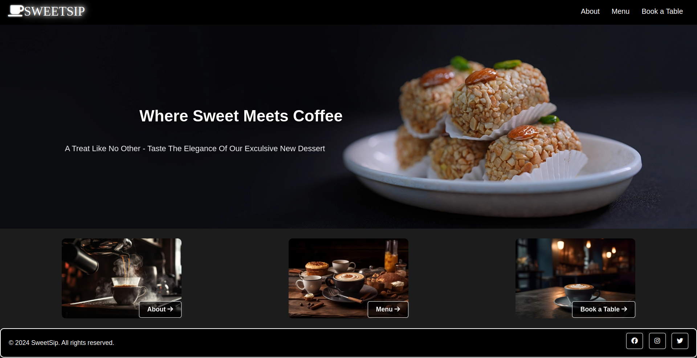

# SweetSip Cafe Website

Welcome to **SweetSip Cafe** , where you can explore your favorite coffee shop, check our menu, and even book a table online. This website is designed to make your experience seamless and enjoyable.

## Description

SweetSip is a mordern website for a cafe that allows customers to:

- View the Menu online.
- Reserve a table in advance.
- Learn about the cafe and it's offerings.

The website is **responsive** and Works seamlessly on all devices .

---

## Features

- **Navigation Bar :** A simple menu with links to the main pages.
- **Home Page :** Features a welcoming image, popular products, and a footer with social media icons .
- **Menu Page :** Displays the menu with images and prices in a grid layout .
- **Abot Page :** Describes the cafe's story with text and images .
- **BooK a Tabel Page :** Includes an elegant from with fields for name, email, date, and more.

---

## Technologien

- **Animations** : For styling and effects .
- **Flexbox und Grid** : For a clean and responsive layout.
- **Media Queries** : To adapt the website to different screen sizes.

---

## Live-view

https://khushbu551.github.io/SweetSip/

---

## Preview

